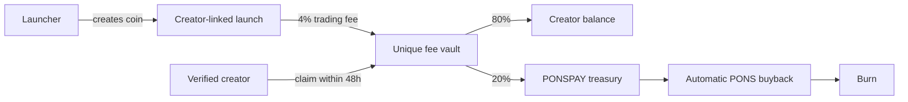

<p align="center">
  <a href="https://ponspay.app">
    
  </a>
</p>

<p align="center">
  Creator-linked coin launches with verified social identity, onchain fee vaults, and automatic PONS buybacks.
</p>

<p align="center">
  <a href="https://ponspay.app">Website</a> ·
  <a href="https://ponspay.app/launch">Launch</a> ·
  <a href="https://ponspay.app/creator">Creator vault</a> ·
  <a href="https://x.com/Ponspayapp">X</a>
</p>

<p align="center">
  
  
  
</p>

# PONSPAY

PONSPAY lets anyone launch a coin linked to an Instagram or TikTok creator. The launch routes its 4% creator fee to a unique onchain vault. The creator can later verify the linked social account, see every launch connected to that identity, claim the available fee batches, and withdraw to an EVM address.

The launcher supplies the creator handle or profile URL. PONSPAY normalizes it to the canonical social profile, fixes that profile as the token website, creates a unique vault for the launch, and records the public route and receipts.

## Fee routing

- Every creator-linked launch uses a fixed 4% trading fee.
- When the creator claims an open batch within 48 hours, 80% becomes withdrawable creator balance.
- The remaining 20% is transferred to the PONSPAY development treasury and queued for an automatic market buyback and burn of the official PONS token.
- Fees generated by the official PONS coin follow a separate treasury policy: 5% is queued for buyback and burn and 95% remains in the development treasury.
- If a creator batch expires after 48 hours, the vault settles it according to the onchain expiry policy.

Buyback jobs are idempotent and move through pending, submitted, and confirmed states. Transaction hashes remain available as public receipts.

## How it works

1. A launcher chooses Instagram or TikTok and enters a creator handle or profile URL.
2. PONSPAY creates and links a unique deterministic fee vault.
3. The launcher reviews the token, connects a wallet, and signs the launch transaction.
4. The creator signs in through Phyllo and verifies control of the linked social account.
5. PONSPAY opens all vaults linked to that identity and relays authorized claims and withdrawals.

PONSPAY never receives the creator's social password. Provider credentials, attestation keys, and operator keys stay in hosted secrets and are never sent to the browser.



## Architecture

- Cloudflare Worker/Vinext frontend and API
- D1 for creator routes, launch records, fee batches, verification sessions, withdrawals, and buyback jobs
- R2 for cached creator profile images
- `CreatorFeeVaultFactory` for deterministic, unique vault deployment
- `CreatorFeeVault` for 48-hour fee lots, creator balances, withdrawals, and expiry settlement
- `PonsBuybackBurner` for constrained PONS swaps and burns
- A hosted operator for indexing, relayed claims, withdrawals, treasury collection, and buyback execution
- Phyllo Connect for Instagram and TikTok identity verification

## Local development

This repository requires Node.js 22.13 or newer.

```bash
npm install
npm run dev
```

Set deployment values as hosted secrets or environment variables. Never commit their values.

```text
PHYLLO_CLIENT_ID
PHYLLO_CLIENT_SECRET
PHYLLO_ENVIRONMENT
PUBLIC_APP_URL
INGEST_HMAC_SECRET
CLAIM_ATTESTOR_PRIVATE_KEY
FACTORY_ADDRESS
VAULT_FACTORY_ADDRESS
ROBINHOOD_RPC_URL
```

## Validation

```bash
npm run build
node --test test/creator-vault.test.mjs
```

The contract integration test deploys the system to a local EVM chain and checks deterministic vault creation, creator authorization, fee allocation, withdrawal, expiry, and replay protection.

## Security

- `.env*`, private keys, hosted credentials, generated output, and local execution state are excluded from Git.
- Claims and withdrawals require typed, expiring, replay-protected attestations.
- Buybacks use minimum-output checks and recorded job state.
- Production contracts should receive an independent security audit before the protocol manages material value.

## License

Copyright © PONSPAY. All rights reserved.
